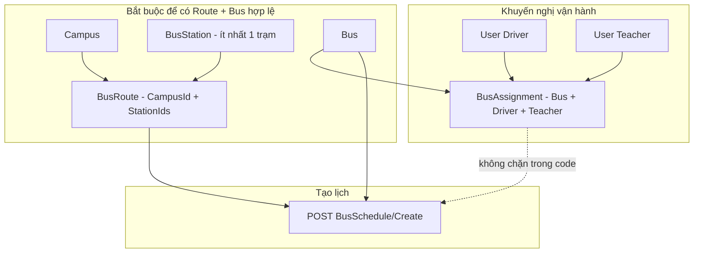

# Luồng: Chuẩn bị dữ liệu và tạo lịch chạy xe (BusSchedule)

Tài liệu mô tả **toàn bộ các bước cần có** (và các bước **nên có** về mặt vận hành) để có thể **tạo thành công một lịch chạy** `POST /api/BusSchedule/Create`, căn theo `BusScheduleService`, `BusRouteService`, `BusAssignmentService`, `BusService` và helper `ScheduleDayOfWeek`.

---

## Chuẩn `ResponseDto` (cho FE ghép API)

Controller dùng `BE_API.Dto.Common.ResponseDto`:


| Field (JSON) | Kiểu    | Ghi chú |
| ------------ | ------- | ------- |
| `message`    | `string | null`   |
| `data`       | `object | array   |


- **Header:** `Content-Type: application/json` cho body JSON.
- **Tên thuộc tính:** mặc định ASP.NET Core serialize **camelCase** (`busId`, `startDate`, `stationIds`, …).
- `**TimeSpan`:** gửi/nhận dạng chuỗi `**"HH:mm:ss"`** (ví dụ `"06:00:00"`, `"17:30:00"`).
- `**DateTime`:** ISO 8601 (ví dụ `"2026-04-21T00:00:00Z"` hoặc `"2026-04-21"` — phần ngày vẫn được service normalize).

**Thành công (200):**

```json
{
  "message": "…",
  "data": { }
}
```

**Lỗi nghiệp vụ / validate (thường 400 Bad Request):**

```json
{
  "message": "Nội dung lỗi từ server (tiếng Việt trong code)",
  "data": null
}
```

FE nên đọc `**message**` để hiển thị; `**data**` tuỳ endpoint (có thể `null`).

**Phân trang `PagedResult<T>`** (Search nhiều màn): `data` có dạng:

```json
{
  "message": "…",
  "data": {
    "totalItems": 42,
    "page": 1,
    "pageSize": 10,
    "items": [ ]
  }
}
```

---

## Mục tiêu cuối

Gọi `**POST /api/BusSchedule/Create**` với `BusScheduleCreateDto` và nhận **200** + `data` là `BusScheduleDto`, không bị lỗi validate (bus/route/campus/ngày giờ/trùng lịch/`ShiftType`/`DayOfWeek`).

---

## Phân loại bước


| Loại                                       | Nội dung                                                                                                                                                  |
| ------------------------------------------ | --------------------------------------------------------------------------------------------------------------------------------------------------------- |
| **Bắt buộc (theo ràng buộc khi tạo lịch)** | Có **xe** `ACTIVE`, có **tuyến** bật (`IsEnabled`) thuộc **campus** đang hoạt động — tức là trước đó phải có **campus**, **trạm**, **tuyến** (và **xe**). |
| **Không bắt buộc để tạo bản ghi lịch**     | **Phân công** tài xế / cán bộ (`BusAssignment`). Service tạo lịch **không** kiểm tra đã phân công hay chưa.                                               |
| **Nên làm trước khi chạy thực tế**         | Tạo user **driver** / **teacher** và **BusAssignment** để app tài xế (`GetDriverSchedules`, xác nhận trạm, …) hoạt động đúng nghiệp vụ.                   |


---

## Sơ đồ thứ tự (chuẩn bị → tạo lịch)




Thứ tự **xe / campus / trạm** có thể linh hoạt: xe có thể tạo trước hoặc sau campus/trạm; **tuyến** bắt buộc sau khi đã có campus + trạm dùng trong `StationIds`.

---

## Bước 1 — Campus (master data)

**Mục đích:** `BusRoute` cần `CampusId`; khi tạo lịch, `ValidateRouteAsync` kiểm tra **campus của tuyến đang active**.


|             |                                                                                |
| ----------- | ------------------------------------------------------------------------------ |
| **Tạo**     | `POST /api/Campus/Create` — `CampusCreateDto`                                  |
| **Tra cứu** | `GET /api/Campus/Search`, `GET /api/Campus/Active`, `GET /api/Campus/Get/{id}` |


**Lưu ý:** Campus phải ở trạng thái hoạt động (`IsActive`) thì tuyến mới pass validate khi tạo lịch.

**Request — `POST /api/Campus/Create`**

```json
{
  "code": "CAMPUS-01",
  "name": "Cơ sở A",
  "address": "123 Đường …",
  "phone": "0281234567",
  "isActive": true,
  "imageUrl": null
}
```

**Response 200 — tạo thành công:** controller **không** gán `data` — FE nhận `message`, `data` thường `**null`**; lấy `campusId` bằng `GET /api/Campus/Search` / `Active` / `Get/{id}`.

```json
{
  "message": "Tạo campus thành công",
  "data": null
}
```

*(Chuỗi `message` đúng theo hằng trong controller; có thể không có dấu chấm cuối.)*

**Response 200 — `GET /api/Campus/Get/{id}*`* (`data` là `CampusDto`):

```json
{
  "message": "Lấy campus thành công",
  "data": {
    "id": 1,
    "code": "CAMPUS-01",
    "name": "Cơ sở A",
    "address": "123 Đường …",
    "phone": "0281234567",
    "isActive": true,
    "imageUrl": null
  }
}
```

**Response 200 — `GET /api/Campus/Search?keyword=&page=1&pageSize=10`:** `data` là `**PagedResult<CampusDto>`** (xem mục envelope).

---

## Bước 2 — Trạm dừng (BusStation)

**Mục đích:** `BusRouteCreateDto` **bắt buộc** có `StationIds` **không rỗng** (service báo lỗi nếu danh sách trống). Thứ tự phần tử trong `StationIds` quyết định thứ tự trên tuyến (`OrderIndex` 1, 2, …).


|             |                                                              |
| ----------- | ------------------------------------------------------------ |
| **Tạo**     | `POST /api/BusStation/Create` — `BusStationCreateDto`        |
| **Tra cứu** | `GET /api/BusStation/Search`, `GET /api/BusStation/Get/{id}` |


**Request — `POST /api/BusStation/Create`**

```json
{
  "name": "Trạm 1",
  "address": "Điểm đón …",
  "description": null,
  "latitude": 10.762622,
  "longitude": 106.660172,
  "isEnabled": true
}
```

**Response 200 — tạo:** `message` thành công, `**data` thường `null`** — lấy `stationId` qua Search/Get.

**Response 200 — `GET /api/BusStation/Get/{id}`** (`BusStationDto`):

```json
{
  "message": "Lấy bus station thành công",
  "data": {
    "id": 10,
    "name": "Trạm 1",
    "address": "Điểm đón …",
    "description": null,
    "latitude": 10.762622,
    "longitude": 106.660172,
    "isEnabled": true
  }
}
```

---

## Bước 3 — Xe bus (Bus)

**Mục đích:** `BusScheduleCreateDto.BusId` trỏ tới xe; `ValidateBusAsync` yêu cầu xe **tồn tại** và `Status` = `**ACTIVE`** (so sánh không phân biệt hoa thường).


|             |                                                |
| ----------- | ---------------------------------------------- |
| **Tạo**     | `POST /api/Bus/Create` — `BusCreateDto`        |
| **Tra cứu** | `GET /api/Bus/Search`, `GET /api/Bus/Get/{id}` |


**Lưu ý:**

- Nếu không gửi `status` khi tạo xe, `BusService` mặc định `**ACTIVE`**.
- `GET /api/Bus/GetByCampus/{campusId}` chỉ trả xe **đã có lịch** gắn tuyến thuộc campus — xe mới chưa có lịch có thể **không** có trong API này; dùng `Search` / `Get/{id}` để lấy `busId`.

**Request — `POST /api/Bus/Create`**

```json
{
  "licensePlate": "51A-12345",
  "capacity": 45,
  "status": "ACTIVE",
  "busNumber": "BUS-01",
  "imageUrl": null,
  "color": null,
  "busType": null
}
```

**Response 200 — tạo:** `**data` không có trong response** — dùng `GET /api/Bus/Search` hoặc `Get/{id}` để lấy `busId`.

```json
{
  "message": "Tạo bus thành công",
  "data": null
}
```

**Response 200 — `GET /api/Bus/Get/{id}`** (`BusDto`):

```json
{
  "message": "Lấy bus thành công",
  "data": {
    "id": 5,
    "licensePlate": "51A-12345",
    "capacity": 45,
    "status": "ACTIVE",
    "busNumber": "BUS-01",
    "imageUrl": null,
    "color": null,
    "busType": null
  }
}
```

---

## Bước 4 — Tuyến xe (BusRoute)

**Mục đích:** Có `RouteId` hợp lệ cho lịch. `ValidateRouteAsync` yêu cầu tuyến tồn tại, `**IsEnabled`**, và **campus** của tuyến **active**.


|             |                                                                                      |
| ----------- | ------------------------------------------------------------------------------------ |
| **Tạo**     | `POST /api/BusRoute/Create` — `BusRouteCreateDto` (`Name`, `CampusId`, `StationIds`) |
| **Tra cứu** | `GET /api/BusRoute/Get/{id}`, `GET /api/BusRoute/Search`, …                          |


**Request — `POST /api/BusRoute/Create`**

```json
{
  "name": "Tuyến sáng A",
  "campusId": 1,
  "stationIds": [ 10, 11, 12 ]
}
```

**Response 200 — tạo** (`data` là `BusRouteDto` — có danh sách trạm + `orderIndex`):

```json
{
  "message": "Tạo bus route thành công",
  "data": {
    "id": 3,
    "name": "Tuyến sáng A",
    "isEnabled": true,
    "campusId": 1,
    "campusName": "Cơ sở A",
    "stations": [
      {
        "id": 10,
        "name": "Trạm 1",
        "address": "…",
        "description": null,
        "latitude": 10.76,
        "longitude": 106.66,
        "isEnabled": true,
        "orderIndex": 1
      }
    ]
  }
}
```

*(Số phần tử `stations` và field chi tiết khớp dữ liệu thật trong DB.)*

**Response 200 — `GET /api/BusRoute/Get/{id}`:** cùng cấu trúc `data` như trên.

---

## Bước 5 — (Khuyến nghị) Tài xế, cán bộ đưa đón, phân công

**Mục đích nghiệp vụ:** Gán người vận hành cho xe để luồng tài xế (lịch trong ngày, tiến trình trạm) có dữ liệu đúng. **Tạo `BusSchedule` không đọc bảng phân công** trong code hiện tại.


|               |                                                                                                                                     |
| ------------- | ----------------------------------------------------------------------------------------------------------------------------------- |
| **Tạo user**  | `POST /api/User/CreateDriver` (`DriverCreateDto`), `POST /api/User/CreateTeacher` (`TeacherCreateDto`)                              |
| **Phân công** | `POST /api/BusAssignment/Create` — `BusAssignmentCreateDto`: `BusId`, `DriverId`, `TeacherId` (user đúng role `driver` / `teacher`) |
| **Tra cứu**   | `GET /api/User/Search`, `GET /api/BusAssignment/Search`                                                                             |


`BusAssignmentService`: nếu đã có phân công cho **cùng xe** thì **cập nhật** driver/teacher (upsert theo `BusId`).

**Request — `POST /api/User/CreateDriver*`*

```json
{
  "email": "driver01@schoolbus.local",
  "password": "123456",
  "fullName": "Nguyễn Văn Tài",
  "phone": "0901000001",
  "driverLicenseNumber": "GPLX-001",
  "driverLicenseClass": "D",
  "driverLicenseExpiryDate": "2028-12-31T00:00:00Z"
}
```

**Request — `POST /api/User/CreateTeacher`**

```json
{
  "email": "teacher01@schoolbus.local",
  "password": "123456",
  "fullName": "Trần Thị Cán bộ",
  "phone": "0901000002"
}
```

**Response 200 — CreateDriver / CreateTeacher** (`data` là `UserDto`):

```json
{
  "message": "…",
  "data": {
    "id": 20,
    "email": "driver01@schoolbus.local",
    "fullName": "Nguyễn Văn Tài",
    "phone": "0901000001",
    "deviceToken": null,
    "driverLicenseNumber": "GPLX-001",
    "driverLicenseClass": "D",
    "driverLicenseExpiryDate": "2028-12-31T00:00:00Z",
    "roleName": "driver",
    "status": "ACTIVE",
    "createdAt": "2026-04-19T08:00:00Z"
  }
}
```

**Request — `POST /api/BusAssignment/Create`**

```json
{
  "busId": 5,
  "driverId": 20,
  "teacherId": 21
}
```

**Response 200** (`data` là `BusAssignmentDto` — lồng `bus`, `driver`, `teacher`):

```json
{
  "message": "Tạo bus assignment thành công",
  "data": {
    "id": 1,
    "busId": 5,
    "bus": {
      "id": 5,
      "licensePlate": "51A-12345",
      "capacity": 45,
      "status": "ACTIVE",
      "busNumber": "BUS-01",
      "imageUrl": null,
      "color": null,
      "busType": null
    },
    "driverId": 20,
    "driver": {
      "id": 20,
      "email": "driver01@schoolbus.local",
      "fullName": "Nguyễn Văn Tài",
      "phone": "0901000001",
      "deviceToken": null,
      "driverLicenseNumber": "GPLX-001",
      "driverLicenseClass": "D",
      "driverLicenseExpiryDate": "2028-12-31T00:00:00Z",
      "roleName": "driver",
      "status": "ACTIVE",
      "createdAt": "2026-04-19T08:00:00Z"
    },
    "teacherId": 21,
    "teacher": {
      "id": 21,
      "email": "teacher01@schoolbus.local",
      "fullName": "Trần Thị Cán bộ",
      "phone": "0901000002",
      "deviceToken": null,
      "driverLicenseNumber": null,
      "driverLicenseClass": null,
      "driverLicenseExpiryDate": null,
      "roleName": "teacher",
      "status": "ACTIVE",
      "createdAt": "2026-04-19T08:00:00Z"
    }
  }
}
```

---

## Bước 6 — Tạo lịch chạy (BusSchedule)


|          |                                |
| -------- | ------------------------------ |
| **HTTP** | `POST /api/BusSchedule/Create` |
| **Body** | `BusScheduleCreateDto`         |


**Field (camelCase JSON)**


| Field       | Kiểu                   | Ghi chú                             |
| ----------- | ---------------------- | ----------------------------------- |
| `busId`     | number                 | Xe `ACTIVE`                         |
| `routeId`   | number                 | Tuyến bật, campus active            |
| `startDate` | string (ISO date/time) | Sau normalize chỉ còn **phần ngày** |
| `endDate`   | string                 | null                                |
| `startTime` | string                 | `"HH:mm:ss"`                        |
| `endTime`   | string                 | `"HH:mm:ss"`                        |
| `dayOfWeek` | number                 | **0–6**: Thứ Hai = 0 … Chủ nhật = 6 |
| `shiftType` | string                 | `PICKUP`                            |


**Request — `POST /api/BusSchedule/Create`**

```json
{
  "busId": 5,
  "routeId": 3,
  "startDate": "2026-04-21T00:00:00Z",
  "endDate": "2026-12-31T00:00:00Z",
  "startTime": "06:00:00",
  "endTime": "08:30:00",
  "dayOfWeek": 0,
  "shiftType": "PICKUP"
}
```

*(Ví dụ: `dayOfWeek: 0` = **Thứ Hai** — phải khớp ngày trong `startDate`/`endDate` theo quy ước `ScheduleDayOfWeek` khi vận hành.)*

**Response 200 — tạo lịch** (`data` là `BusScheduleDto`):

```json
{
  "message": "Tạo bus schedule thành công",
  "data": {
    "id": 100,
    "busId": 5,
    "busLabel": "BUS-01",
    "routeId": 3,
    "routeName": "Tuyến sáng A",
    "campusId": 1,
    "campusName": "Cơ sở A",
    "startDate": "2026-04-21T00:00:00Z",
    "endDate": "2026-12-31T00:00:00Z",
    "startTime": "06:00:00",
    "endTime": "08:30:00",
    "dayOfWeek": 0,
    "shiftType": "PICKUP",
    "isActive": true
  }
}
```

**Response 200 — `GET /api/BusSchedule/GetByBus/{busId}`** (và tương tự `GetByRoute`, `GetByCampus`, `Search`): `data` là **mảng** `BusScheduleDto[]` (không phân trang).

```json
{
  "message": "Lấy danh sách bus schedule thành công",
  "data": [
    {
      "id": 100,
      "busId": 5,
      "busLabel": "BUS-01",
      "routeId": 3,
      "routeName": "Tuyến sáng A",
      "campusId": 1,
      "campusName": "Cơ sở A",
      "startDate": "2026-04-21T00:00:00Z",
      "endDate": "2026-12-31T00:00:00Z",
      "startTime": "06:00:00",
      "endTime": "08:30:00",
      "dayOfWeek": 0,
      "shiftType": "PICKUP",
      "isActive": true
    }
  ]
}
```

### Ràng buộc trong `BusScheduleService`

1. **Bus:** tồn tại, `**ACTIVE`**.
2. **Route:** tồn tại, `**IsEnabled`**, campus của tuyến **active**.
3. `**NormalizeSchedule` (tạo mới, `requireFutureStartDate: true`):**
  - `**StartDate` phải lớn hơn ngày hiện tại theo `DateTime.UtcNow.Date`** (không được bằng “hôm nay”).
  - Nếu có `EndDate`: `EndDate >= StartDate`.
  - `EndTime > StartTime`.
  - `DayOfWeek` chỉ **0–6**.
4. `**ShiftType`:** sau chuẩn hoá phải là `**PICKUP`**, `**DROPOFF`**, hoặc `**ROUNDTRIP**` (không phân biệt hoa thường lúc gửi; lưu dạng upper).
5. `**EnsureBusScheduleNotOverlappedAsync`:** không trùng khung giờ trên **cùng xe** và **cùng `DayOfWeek`** với lịch khác có giao cắt khoảng ngày hiệu lực (điều kiện thời gian trong service).

### Quy ước `DayOfWeek` (quan trọng)

Hệ thống dùng `**ScheduleDayOfWeek.FromDate**` (`BE_API.Common.ScheduleDayOfWeek`):

- **Thứ Hai = 0**, …, **Chủ nhật = 6**.

Khi tạo lịch, gửi `**DayOfWeek` đúng quy ước này** để:

- `GetBusSchedulesAtTime` và `**BusTripProgressService.ValidateScheduleAsync`** so khớp ngày chạy với `schedule.DayOfWeek` **nhất quán**.

*(Không dùng trực tiếp `System.DayOfWeek` — Chủ nhật = 0 — cho trường lưu trong DB.)*

### Tra cứu sau khi tạo

`GET /api/BusSchedule/Get/{id}`, `GET /api/BusSchedule/GetByBus/{busId}`, `GET /api/BusSchedule/GetByRoute/{routeId}`, `GET /api/BusSchedule/Search`, …

---

## Checklist trước khi `POST /api/BusSchedule/Create`

- Đã có `campusId` và campus **active**.
- Đã có ít nhất một `stationId` và đã gắn vào tuyến qua `StationIds`.
- Đã có `routeId` (tuyến **enabled**).
- Đã có `busId` (xe **ACTIVE**).
- `StartDate` **> hôm nay (UTC date)**.
- `StartTime` / `EndTime` / `EndDate` (nếu có) hợp lệ.
- `DayOfWeek` **0–6** theo quy ước **Thứ Hai = 0 … Chủ nhật = 6**.
- `ShiftType` thuộc một trong **PICKUP / DROPOFF / ROUNDTRIP**.
- Không trùng lịch với lịch khác của cùng xe (cùng ngày trong tuần và khung giờ).

---

## Ví dụ `GET` có phân trang (FE map `data.items`)

`**GET /api/Campus/Search?keyword=&page=1&pageSize=10`**

```json
{
  "message": "Lấy danh sách campus thành công",
  "data": {
    "totalItems": 1,
    "page": 1,
    "pageSize": 10,
    "items": [
      {
        "id": 1,
        "code": "CAMPUS-01",
        "name": "Cơ sở A",
        "address": "123 Đường …",
        "phone": "0281234567",
        "isActive": true,
        "imageUrl": null
      }
    ]
  }
}
```

`**GET /api/Bus/Search?keyword=&page=1&pageSize=10**` — cùng cấu trúc `data`, `items` là mảng `BusDto`.

`**GET /api/User/Search?role=driver&page=1&pageSize=10**` — `items` là mảng `UserDto` (dùng `id` làm `driverId` / `teacherId`).

`**GET /api/BusRoute/Search?campusId=1&page=1&pageSize=10**` — `items` là mảng `BusRouteDto` (thường gọn hơn bản `Get/{id}` tùy service; để đủ trạm + `orderIndex` nên dùng `**Get /api/BusRoute/Get/{id}**` sau khi có `routeId`).

---

## Bảng tóm tắt endpoint (theo luồng này)


| Bước                           | POST / hành động chính                                                           | GET tra cứu (ví dụ)                                         |
| ------------------------------ | -------------------------------------------------------------------------------- | ----------------------------------------------------------- |
| Campus                         | `POST /api/Campus/Create`                                                        | Search / Get                                                |
| Trạm                           | `POST /api/BusStation/Create`                                                    | Search                                                      |
| Xe                             | `POST /api/Bus/Create`                                                           | `GET /api/Bus/Search`, `GET /api/Bus/Get/{id}`              |
| Tuyến                          | `POST /api/BusRoute/Create`                                                      | `GET /api/BusRoute/Get/{id}`, Search                        |
| User + Phân công (khuyến nghị) | `POST /api/User/CreateDriver`, `CreateTeacher`, `POST /api/BusAssignment/Create` | `GET /api/User/Search`, `GET /api/BusAssignment/Search`     |
| Lịch                           | `POST /api/BusSchedule/Create`                                                   | `GET /api/BusSchedule/GetByBus/{busId}`, `Get/{id}`, Search |


---

## File tham chiếu trong repo

- `Common/ScheduleDayOfWeek.cs` — quy ước Thứ Hai = 0 … Chủ nhật = 6  
- `Service/BusScheduleService.cs` — `CreateBusScheduleAsync`, `NormalizeSchedule`, `EnsureBusScheduleNotOverlappedAsync`, `ValidateBusAsync`, `ValidateRouteAsync`  
- `Service/BusTripProgressService.cs` — `ValidateScheduleAsync` (khớp `DayOfWeek` với ngày chạy)  
- `Dto/BusSchedule/BusScheduleCreateDto.cs`  
- `luồng/02-luong-xe-tuyen-phan-cong-lich.md` — luồng tổng quan xe → tuyến → phân công → lịch (bổ sung cho nhau với tài liệu này)

---

*Tài liệu căn theo code BE hiện tại; nếu đổi rule `StartDate` hoặc quy ước `DayOfWeek`, cần cập nhật lại mục ràng buộc và checklist.*