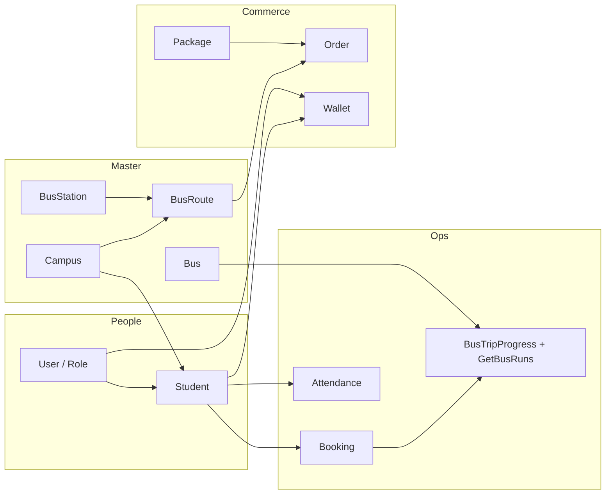

# Luồng 1 — Admin đăng nhập app: master data → người dùng → học sinh/phụ huynh → gói & order

Tài liệu mô tả **một lộ trình E2E hợp lý** cho admin (hoặc app quản trị) gọi API BE. Mọi endpoint đều nằm dưới `BASE_URL` (ví dụ `https://localhost:5001`). Body mẫu chi tiết hơn có thể xem thêm [`API_TEST_JSON.md`](./API_TEST_JSON.md).

---

## 1. Quy ước chung

| Mục | Giá trị |
|-----|---------|
| Envelope JSON | Hầu hết API trả `{ "message": string, "data": object \| null }` (`ResponseDto`). **Không** có thêm field `success` — UI dựa vào **HTTP status code** và `message`. |
| Phân trang | `Search` thường trả `data` kiểu `PagedResult<T>`: `{ "totalItems", "page", "pageSize", "items": [...] }`. |
| JWT | Sau `Login`, gửi `Authorization: Bearer <token>` cho các API cần xác thực (nếu controller có `[Authorize]`). Hiện nhiều endpoint admin **chưa** bắt buộc JWT trên controller; vẫn nên gắn token khi triển khai production. |
| ID tham chiếu | Luôn ưu tiên **GET** (Search / Get / Active) để lấy `id`, `campusId`, `stationIds`, `guardianId`, `walletId` rồi mới gọi POST/PUT. |

### 1.1 HTTP status & JSON thất bại (controller hiện tại)

Hầu hết controller bọc `try/catch` và trả:

| HTTP | Ý nghĩa cho UI |
|------|----------------|
| **200** | Thành công (kể cả khi `data` là `null` — đọc `message`). |
| **400** | Lỗi nghiệp vụ / validate (`Exception.Message` đưa vào `message`). |
| **401 / 403** | Chỉ khi endpoint có `[Authorize]` và token thiếu / không đủ quyền. |
| **5xx** | Lỗi server (không bọc trong `ResponseDto` nếu crash ngoài catch). |

**JSON thất bại (400)** — cùng shape với thành công, `data` thường `null`:

```json
{
  "message": "Bus route khong ton tai",
  "data": null
}
```

**JSON thất bại khi đăng nhập** (`POST /api/Account/Login` — `400`, message theo BE thực tế):

Không tìm thấy email:

```json
{
  "message": "Khong tim thay tai khoan",
  "data": null
}
```

Sai mật khẩu:

```json
{
  "message": "Sai mat khau can kiem tra lai mat khau",
  "data": null
}
```

Tài khoản bị vô hiệu:

```json
{
  "message": "Tai khoan da bi vo hieu hoa. Vui long lien he quan tri vien.",
  "data": null
}
```

**JSON thành công** (nhắc lại để UI map thống nhất):

```json
{
  "message": "Lay danh sach campus thanh cong",
  "data": {
    "totalItems": 2,
    "page": 1,
    "pageSize": 10,
    "items": []
  }
}
```

**Gợi ý FE:** `const ok = response.ok` (fetch) hoặc `status === 200` (axios); parse body JSON rồi hiển thị `message` khi lỗi.

---

### 1.2 Bảng Status / enum — UI dùng để filter, badge, màu

Các giá trị dưới đây là **chuỗi** API thường trả (hoặc gửi lên) trừ khi ghi chú khác. So sánh **không phân biệt hoa thường** nếu BE đã `ToUpper`/`OrdinalIgnoreCase` (booking search, v.v.) — an toàn nhất là **giữ đúng casing** dưới đây.

| Miền | Field trong JSON / DTO | Giá trị hợp lệ | Nguồn / ghi chú |
|-------|-------------------------|----------------|-----------------|
| **Booking** | `status` | `PENDING`, `CONFIRMED`, `CANCELLED` | `Booking/Search`, `Booking/Update` |
| **Order** | `status` | `PENDING`, `PAID`, `CANCELLED`, `EXPIRED` | `Entites.Enums.OrderStatus` |
| **Bus** | `status` | `ACTIVE`, `DEACTIVE`, `MAINTENANCE` | `Bus/Create`, `Bus/Update` |
| **User** (tài khoản) | `status` (trong DTO user) | `ACTIVE`, `DISABLED` | `Entites.Enums.AccountStatus` — `User/Search` filter `status` |
| **Student** | `status` | `ACTIVE`, `DISABLED` | Cùng enum tài khoản học sinh |
| **Attendance** | `status` (query filter & record) | `CHECKED_IN`, `CHECKED_OUT` | `Attendance/Search` |
| **Package** | `status` | Thường dùng `ACTIVE` / `INACTIVE` (chuỗi tự do nhưng nên chuẩn hóa UI) | BE không khóa enum cứng ở create — lưu `Trim()` |
| **Package** | `type` (nếu có) | Ví dụ `MONTHLY` | Theo seed / `API_TEST_JSON` |
| **BusRun** (lịch chạy, DTO booking) | `status` | `ASSIGNED`, `BACKUP` | Sau auto-assign / staff; dùng làm `shiftType` trong lịch tài xế/GV |
| **BusTripProgress — Current** | `tripStatus` | `NOT_STARTED`, `AT_STATION`, `COMPLETED` | Xe đang ở đâu trên tuyến (trạm hiện tại / tiếp theo) |
| **BusTripProgress — History** (theo chuyến) | `tripStatus` | `COMPLETED`, `IN_PROGRESS`, `HAS_ATTENDANCE`, `NO_DATA` | Tổng hợp lần chạy đã qua |
| **Giao dịch ví** (`TransactionHistory`) | `status` | `PENDING`, `PAID`, `CANCELLED`, `FAILED` | `WalletTopUpStatus`; có thể gặp thêm `PAYOS_URL_VERIFICATION` trong luồng PayOS |
| **Thanh toán** (Payment entity, ít expose trực tiếp ra admin flow) | `status` | `SUCCESS`, `FAILED` | `PaymentStatus` |

**Lưu ý:** Một số API filter `status` theo query string — giá trị phải **khớp** chuỗi BE chấp nhận (xem [`API_TEST_JSON.md`](./API_TEST_JSON.md) từng mục).

---

## 2. Thứ tự nghiệp vụ đề xuất vs thứ tự “màn hình”

Bạn có thể hiển thị menu theo thứ tự: **Xe → Tuyến → Trạm → Campus…**, nhưng **dữ liệu phụ thuộc** nên làm theo thứ tự sau để không bị thiếu FK:

1. **Campus** (cơ sở) — `BusRoute` cần `campusId`.
2. **BusStation** (trạm) — `BusRoute/Create` cần `stationIds`.
3. **BusRoute** (tuyến) — gắn campus + danh sách trạm theo thứ tự.
4. **Bus** (xe) — thực thể xe; gán vào **BusRun** là bước vận hành (booking / auto-assign), không bắt buộc trước khi tạo tuyến.
5. **User / Role** — tạo phụ huynh, tài xế, giáo viên.
6. **Student** — cần `guardianId`, `campusId`.
7. **Chi tiết học sinh** — booking, attendance, ví (theo phụ huynh).
8. **Package** — trước **Order** (order tham chiếu `packageId`, `routeIds`).
9. **Lịch chạy / vận hành** — sau khi có **BusRun** (chia xe / gán tài xế–GV): xem cả ngày, theo tài xế hoặc GV, trạng thái trạm hiện tại, lịch sử chuyến.

---

## 3. Sơ đồ phụ thuộc API (tóm tắt)



*(Mũi `G --> L`: có booking/bus run thì mới có dữ liệu lịch chạy thực tế; `D --> L`: tiến độ gắn `busId`.)*

---

## 4. Bước chi tiết (kèm JSON mẫu & GET cần dùng)

### Bước 0 — Đăng nhập admin

| Mục | Nội dung |
|-----|----------|
| **API** | `POST /api/Account/Login` |
| **Phụ thuộc** | Không. |
| **Request** | `{ "email": "admin@schoolbus.local", "password": "123456", "deviceToken": null }` |
| **Response** `200` | `{ "message": "...", "data": { "token": "eyJhbGciOiJIUzI1NiIs..." } }` |
| **Tiếp theo** | `GET /api/Account/Me` (header Bearer) để xác nhận user hiện tại nếu cần. |

---

### Bước 1 — CRUD Campus (nên làm trước BusRoute)

| CRUD | Method & path |
|------|----------------|
| List / tìm | `GET /api/Campus/Search?keyword=&page=1&pageSize=10` |
| Đang hoạt động | `GET /api/Campus/Active?...` |
| Chi tiết | `GET /api/Campus/Get/{id}` |
| Tạo | `POST /api/Campus/Create` |
| Sửa | `PUT /api/Campus/Update/{id}` |
| Xóa | `DELETE /api/Campus/Delete/{id}` |

**Create — request:**

```json
{
  "code": "CS1",
  "name": "Campus Quan 1",
  "address": "100 Nguyen Hue, Q1",
  "phone": "02838223344",
  "isActive": true,
  "imageUrl": "https://cdn.example/campus-1.jpg"
}
```

**Response** (ví dụ tạo thành công, một số endpoint chỉ trả message):

```json
{
  "message": "Tạo campus thành công",
  "data": null
}
```

**GET cần cho bước sau:** `GET /api/Campus/Search` hoặc `Get/{id}` → lấy `campusId` (ví dụ `1`) cho **Student** và **BusRoute**.

---

### Bước 2 — CRUD BusStation (cần trước khi gắn trạm vào tuyến)

| CRUD | Method & path |
|------|----------------|
| List | `GET /api/BusStation/Search?keyword=&page=1&pageSize=10` |
| Chi tiết | `GET /api/BusStation/Get/{id}` |
| Tạo | `POST /api/BusStation/Create` |
| Sửa | `PUT /api/BusStation/Update/{id}` |
| Xóa | `DELETE /api/BusStation/Delete/{id}` |

**Create — request:**

```json
{
  "name": "Trạm Công viên",
  "address": "123 Lê Lợi, Q1",
  "description": "Điểm đón",
  "latitude": 10.7769,
  "longitude": 106.7009,
  "isEnabled": true
}
```

**GET cho bước sau:** lưu danh sách `id` trạm (vd `[1,2,3]`) dùng trong `BusRoute/Create` → `stationIds`.

---

### Bước 3 — CRUD BusRoute

| CRUD | Method & path |
|------|----------------|
| List | `GET /api/BusRoute/Search?keyword=&campusId=1&page=1&pageSize=10` |
| Active | `GET /api/BusRoute/Active?campusId=1&...` |
| Chi tiết | `GET /api/BusRoute/Get/{id}` |
| Tạo | `POST /api/BusRoute/Create` |
| Sửa | `PUT /api/BusRoute/Update/{id}` |
| Xóa | `DELETE /api/BusRoute/Delete/{id}` |

**Phụ thuộc GET:** `campusId` từ **Campus**; `stationIds` từ **BusStation/Search** hoặc **Get**.

**Create — request:**

```json
{
  "name": "Tuyến A - Sáng",
  "campusId": 1,
  "stationIds": [1, 2, 3]
}
```

**Response** (tạo có trả DTO tuyến — ví dụ minh họa):

```json
{
  "message": "Tạo bus route thành công",
  "data": {
    "id": 10,
    "name": "Tuyến A - Sáng",
    "isEnabled": true,
    "campusId": 1,
    "campusName": "Campus Quan 1",
    "stations": [
      { "stationId": 1, "orderIndex": 1, "stationName": "Trạm Công viên" }
    ]
  }
}
```

---

### Bước 4 — CRUD Bus

| CRUD | Method & path |
|------|----------------|
| List | `GET /api/Bus/Search?keyword=&page=1&pageSize=10` |
| Chi tiết | `GET /api/Bus/Get/{id}` |
| Theo campus (xe đã từng chạy tuyến thuộc campus) | `GET /api/Bus/GetByCampus/{campusId}` |
| Tạo | `POST /api/Bus/Create` |
| Sửa | `PUT /api/Bus/Update/{id}` |
| Xóa | `DELETE /api/Bus/Delete/{id}` |

**Create — request:**

```json
{
  "licensePlate": "51B-12345",
  "capacity": 45,
  "status": "ACTIVE",
  "busNumber": "BUS-01",
  "imageUrl": "https://cdn.example/bus.jpg",
  "color": "Yellow",
  "busType": "45-Seat"
}
```

**Phụ thuộc:** không bắt buộc campus khi tạo xe; `GetByCampus` cần `campusId` từ **Campus** để lọc xe theo lịch chạy.

---

### Bước 5 — Role (tuỳ chọn) & CRUD User

**Role** (ít đổi trên môi trường đã seed): `GET /api/Role/Search` — lấy `id` / tên role nếu UI cần.

**User**

| CRUD | Method & path |
|------|----------------|
| List | `GET /api/User/Search?keyword=&role=guardian&status=ACTIVE&page=1&pageSize=10` |
| Chi tiết | `GET /api/User/Get/{id}` |
| Tạo (theo role chữ) | `POST /api/User/Create` |
| Import Excel | `POST /api/User/Import` (multipart) |
| Sửa | `PUT /api/User/Update/{id}` |
| Vô hiệu | `DELETE /api/User/Delete/{id}` |

**Create user (phụ huynh) — request:**

```json
{
  "email": "phuhuynh@example.com",
  "password": "123456",
  "fullName": "Nguyễn Văn A",
  "phone": "0909123456",
  "role": "guardian"
}
```

**Response** (ví dụ):

```json
{
  "message": "Tạo user thành công",
  "data": {
    "id": 42,
    "email": "phuhuynh@example.com",
    "fullName": "Nguyễn Văn A",
    "role": "guardian",
    "status": "ACTIVE"
  }
}
```

**Giáo viên / tài xế** (API riêng, vẫn là user hệ thống):

- `POST /api/User/CreateTeacher` — body theo `TeacherCreateDto` (xem `API_TEST_JSON.md`).
- `POST /api/User/CreateDriver` — body theo `DriverCreateDto`.

**GET cho bước sau:** `User/Search?role=guardian` hoặc `Get/{id}` → `guardianId` cho **Student** và **Order** / **Wallet**.

---

### Bước 6 — Xem phụ huynh & học sinh; chi tiết học sinh (booking + attendance + ví)

#### 6.1 Danh sách phụ huynh

- `GET /api/User/Search?role=guardian&status=ACTIVE&page=1&pageSize=20`

#### 6.2 Danh sách học sinh (lọc campus / phụ huynh)

- `GET /api/Student/Search?keyword=&campusId=1&guardianId=42&status=ACTIVE&page=1&pageSize=20`
- Hoặc `GET /api/Student/GetByGuardian/{guardianId}` / `GetByCampus/{campusId}`

#### 6.3 Chi tiết một học sinh

- `GET /api/Student/Get/{studentId}`

**Response** `data` (rút gọn theo `StudentDto`):

```json
{
  "id": 1,
  "studentCode": "ST001",
  "fullName": "Trần B",
  "guardianId": 42,
  "guardianName": "Nguyễn Văn A",
  "campusId": 1,
  "campusName": "Campus Quan 1",
  "status": "ACTIVE"
}
```

#### 6.4 Lịch booking của học sinh

- **Phụ thuộc:** `studentId` từ `Student/Get`.
- **API:** `GET /api/Booking/Search?studentId=1&page=1&pageSize=20`  
  Tuỳ chọn: `routeId`, `serviceDate`, `status` (`PENDING` \| `CONFIRMED` \| `CANCELLED`).

**Response** `data.items` (mỗi phần tử kiểu booking DTO — minh họa):

```json
{
  "totalItems": 3,
  "page": 1,
  "pageSize": 20,
  "items": [
    {
      "id": 100,
      "studentId": 1,
      "routeId": 10,
      "routeName": "Tuyến A - Sáng",
      "serviceDate": "2026-05-10T00:00:00",
      "startTime": "07:00:00",
      "status": "CONFIRMED",
      "stationName": "Trạm Công viên"
    }
  ]
}
```

#### 6.5 Lịch sử điểm danh

- **Phụ thuộc:** `studentId`.
- **API:** `GET /api/Attendance/GetByStudent/{studentId}?fromDate=2026-04-01&toDate=2026-04-30`

#### 6.6 Ví (wallet) của phụ huynh

- **Phụ thuộc:** `guardianId` từ `Student/Get` (user phụ huynh = chủ ví).
- **API ví:** `GET /api/Wallet/GetByUser/{guardianId}`
- **Lịch sử giao dịch:** `GET /api/Wallet/TransactionHistory/{walletId}?fromDate=&toDate=&page=1&pageSize=20`  
  → `walletId` lấy từ field trong response `GetByUser` (cấu trúc `WalletDto` — xem Swagger hoặc service).

**Ví dụ** `GetByUser` `data` (theo `WalletDto`):

```json
{
  "id": 5,
  "userId": 42,
  "userName": "Nguyễn Văn A",
  "email": "phuhuynh@example.com",
  "balance": 350000
}
```

---

### Bước 7 — CRUD Package

| CRUD | Method & path |
|------|----------------|
| List / Active | `GET /api/Package/Search` · `GET /api/Package/Active` |
| Chi tiết | `GET /api/Package/Get/{id}` |
| Tạo / Sửa / Xóa | `POST /api/Package/Create` · `PUT /api/Package/Update/{id}` · `DELETE /api/Package/Delete/{id}` |

**GET trước Order:** `Package/Get/{id}` hoặc `Active` → `packageId`.

---

### Bước 8 — Xem / tạo Order

| Mục | API |
|-----|-----|
| Danh sách | `GET /api/Order/Search?guardianId=42&studentId=1&status=&fromDate=&toDate=&page=1&pageSize=10` |
| Chi tiết | `GET /api/Order/Get/{id}` |
| Theo phụ huynh | `GET /api/Order/GetByGuardian/{guardianId}` |
| Theo học sinh (active) | `GET /api/Order/GetActiveByStudent/{studentId}` |
| Tạo order | `POST /api/Order/Create` |
| Link PayOS | `POST /api/Order/CreatePayOsLink` |

**Phụ thuộc GET trước khi tạo order:**

- `guardianId`, `studentId` từ **Student** / **User**.
- `packageId` từ **Package**.
- `routeIds`: mảng `id` tuyến từ **BusRoute/Search** (đúng campus / nghiệp vụ).

**Create — request:**

```json
{
  "guardianId": 42,
  "studentId": 1,
  "packageId": 1,
  "routeIds": [10]
}
```

---

### Bước 9 — Lịch trình chạy xe trong ngày (tài xế, giáo viên, xe, trạm, lịch sử)

Dùng khi admin cần biết **ngày đó** chuyến nào có **tài xế / giáo viên**, **xe gì** (`busLabel` = biển số hoặc số xe), **đang / sắp tới trạm nào**, và **lịch sử** các lần chạy trước.

#### 9.1 Cảnh báo ngày — tất cả BusRun đã lên lịch (filter theo route / xe / người)

| Mục | API |
|-----|-----|
| **Danh sách chuyến theo ngày** | `GET /api/Booking/GetBusRuns?serviceDate=2026-04-29&routeId=&busId=&driverId=&teacherId=` |

- `serviceDate` (bắt buộc cho nghiệp vụ): ngày cần xem.
- Các query còn lại **tùy chọn**: lọc theo tuyến, xe, **tài xế** (`driverId`), **giáo viên** (`teacherId`) — lấy `id` từ `GET /api/User/Search?role=driver` hoặc `role=teacher`.

**Query (minh hoạ — không có body GET):**

```json
{
  "query": {
    "serviceDate": "2026-04-29",
    "routeId": 10,
    "busId": 1,
    "driverId": 15,
    "teacherId": 22
  },
  "note": "Bo trong routeId/busId/driverId/teacherId neu khong loc. serviceDate bat buoc."
}
```

**Response `200` — envelope + `data` là mảng `BusRunDto` (một chuyến mẫu):**

```json
{
  "message": "Lay danh sach lich chay thuc te thanh cong",
  "data": [
    {
      "id": 1001,
      "routeId": 10,
      "routeName": "Tuyen A - Sang",
      "serviceDate": "2026-04-29T00:00:00",
      "startTime": "07:00:00",
      "busId": 1,
      "busLabel": "BUS-01",
      "driverId": 15,
      "driverName": "Tai xe Nguyen A",
      "teacherId": 22,
      "teacherName": "GV Tran B",
      "seatCapacity": 45,
      "usableCapacity": 25,
      "assignedStudentCount": 20,
      "runOrder": 1,
      "status": "ASSIGNED",
      "students": [
        {
          "bookingId": 500,
          "studentId": 3,
          "studentCode": "ST003",
          "studentName": "Le Van C",
          "stationId": 2,
          "stationName": "Tram Cong vien",
          "pickupAddress": "55C Nguyen Thi Minh Khai, Quan 1, TP.HCM",
          "hasCheckedInOnThisBus": true,
          "currentBusId": null,
          "currentBusLabel": null,
          "isOnDifferentBusThanAssigned": false
        }
      ]
    }
  ]
}
```

**Khi không có chuyến nào:** HTTP **200**:

```json
{
  "message": "Lay danh sach lich chay thuc te thanh cong",
  "data": []
}
```

**JSON thất bại (400)** chỉ khi controller/service ném exception — ví dụ:

```json
{
  "message": "Bus run khong ton tai",
  "data": null
}
```

*(Thông điệp cụ thể tùy endpoint / lỗi thực tế.)*

#### 9.2 Lịch trong ngày của **một tài xế** (theo khung giờ)

| Mục | API |
|-----|-----|
| Lịch tài xế | `GET /api/BusTripProgress/DriverSchedules?driverId=10&rideDate=2026-04-29&atTime=07:00:00` |

- `rideDate`: ngày chạy (mặc định có thể là “hôm nay” theo server nếu service cho phép — truyền rõ ngày cho admin).
- `atTime` (tuỳ chọn): “đang xét” khung giờ nào để đánh dấu `isRunningNow`, `isUpcoming`, `isCompleted` trên từng chuyến.

**Query (minh hoạ):**

```json
{
  "query": {
    "driverId": 15,
    "rideDate": "2026-04-29",
    "atTime": "07:00:00"
  },
  "note": "atTime co the bo trong."
}
```

**Response `200` — `data` là mảng `BusTripProgressDriverScheduleDto` (một phần tử mẫu):**

```json
{
  "message": "Lấy danh sách lịch chạy của tài xế thành công",
  "data": [
    {
      "busRunId": 1001,
      "busId": 1,
      "busLabel": "BUS-01",
      "routeId": 10,
      "routeName": "Tuyen A - Sang",
      "rideDate": "2026-04-29T00:00:00",
      "startTime": "07:00:00",
      "shiftType": "ASSIGNED",
      "isRunningNow": true,
      "isUpcoming": false,
      "isCompleted": false,
      "isRecommended": true,
      "students": [
        {
          "studentId": 3,
          "studentCode": "ST003",
          "studentName": "Le Van C",
          "stationId": 2,
          "stationName": "Tram Cong vien",
          "pickupAddress": "55C Nguyen Thi Minh Khai, Quan 1, TP.HCM",
          "pickupLatitude": 10.77678,
          "pickupLongitude": 106.69015,
          "hasCheckedInOnThisBus": true,
          "currentBusId": null,
          "currentBusLabel": null,
          "isOnDifferentBusThanAssigned": false
        }
      ],
      "stations": [
        {
          "stationId": 1,
          "stationName": "Tram A",
          "latitude": 10.77,
          "longitude": 106.69,
          "orderIndex": 1,
          "isVisited": true,
          "arrivedAt": "2026-04-29T00:15:00Z"
        },
        {
          "stationId": 2,
          "stationName": "Tram Cong vien",
          "latitude": 10.776,
          "longitude": 106.7,
          "orderIndex": 2,
          "isVisited": false,
          "arrivedAt": null
        }
      ]
    }
  ]
}
```

#### 9.3 Lịch trong ngày của **một giáo viên**

| Mục | API |
|-----|-----|
| Lịch GV | `GET /api/BusTripProgress/TeacherSchedules?teacherId=20&rideDate=2026-04-29&atTime=07:00:00` |

**Cùng cấu trúc DTO** như tài xế (`BusTripProgressDriverScheduleDto` — danh sách chuyến + trạm + học sinh).

**Query (minh hoạ):**

```json
{
  "query": {
    "teacherId": 22,
    "rideDate": "2026-04-29",
    "atTime": "07:00:00"
  }
}
```

**Response `200`:** cùng dạng mục **9.2** (`message` + `data: [...]` với các field `busRunId`, `busLabel`, `stations[]`, `students[]`, …).

#### 9.4 Trạng thái **thời điểm hiện tại**: xe đang / sắp tới trạm nào

| Mục | API |
|-----|-----|
| Tiến độ chuyến | `GET /api/BusTripProgress/Current?busId=1&busRunId=1001&rideDate=2026-04-29` |

**Phụ thuộc GET:** `busId`, `busRunId` từ **GetBusRuns** (hoặt động 9.1) hoặc từ lịch tài xế/GV.

**Query (minh hoạ):**

```json
{
  "query": {
    "busId": 1,
    "busRunId": 1001,
    "rideDate": "2026-04-29"
  }
}
```

**Response `200` — `data` là một object `BusTripProgressCurrentDto` (mẫu `AT_STATION`):**

```json
{
  "message": "Lấy trạng thái chuyến xe thành công",
  "data": {
    "busId": 1,
    "busRunId": 1001,
    "routeId": 10,
    "routeName": "Tuyen A - Sang",
    "rideDate": "2026-04-29T00:00:00",
    "startTime": "07:00:00",
    "tripStatus": "AT_STATION",
    "currentStationId": 1,
    "currentStationName": "Tram A",
    "arrivedAt": "2026-04-29T00:15:00Z",
    "nextStationId": 2,
    "nextStationName": "Tram Cong vien",
    "nextOrderIndex": 2,
    "isCompleted": false,
    "stations": [
      {
        "stationId": 1,
        "stationName": "Tram A",
        "latitude": 10.77,
        "longitude": 106.69,
        "orderIndex": 1,
        "isVisited": true,
        "arrivedAt": "2026-04-29T00:15:00Z"
      },
      {
        "stationId": 2,
        "stationName": "Tram Cong vien",
        "latitude": 10.776,
        "longitude": 106.7,
        "orderIndex": 2,
        "isVisited": false,
        "arrivedAt": null
      }
    ]
  }
}
```

**Ví dụ `tripStatus`:** `NOT_STARTED` (chưa có log đến trạm), `AT_STATION` (đang trên tuyến giữa các trạm), `COMPLETED` (đã hết trạm).

#### 9.5 Lịch sử các lần chạy (nhiều ngày / nhiều xe / tuyến / campus)

| Mục | API |
|-----|-----|
| Lịch sử chuyến | `GET /api/BusTripProgress/History?busId=&routeId=&campusId=&fromDate=2026-04-01&toDate=2026-04-30` |

- Có thể chỉ truyền `fromDate` / `toDate` để lấy rộng; thu hẹp bằng `busId`, `routeId`, `campusId` (id campus từ **Campus/Search**).

**Query (minh hoạ):**

```json
{
  "query": {
    "busId": 1,
    "routeId": 10,
    "campusId": 1,
    "fromDate": "2026-04-01",
    "toDate": "2026-04-30"
  },
  "note": "busId, routeId, campusId de trong neu xem tong hop."
}
```

**Response `200` — `data` là mảng `BusTripProgressHistoryDto` (một phần tử mẫu):**

```json
{
  "message": "Lấy lịch sử chuyến đi thành công",
  "data": [
    {
      "busRunId": 1001,
      "busId": 1,
      "busLabel": "BUS-01",
      "routeId": 10,
      "routeName": "Tuyen A - Sang",
      "campusId": 1,
      "campusName": "Campus Quan 1",
      "rideDate": "2026-04-29T00:00:00",
      "startTime": "07:00:00",
      "shiftType": "ASSIGNED",
      "driverId": 15,
      "driverName": "Tai xe Nguyen A",
      "teacherId": 22,
      "teacherName": "GV Tran B",
      "plannedStudentCount": 20,
      "actualStudentCount": 18,
      "visitedStationCount": 5,
      "totalStationCount": 5,
      "actualStartAt": "2026-04-29T00:14:00Z",
      "actualEndAt": "2026-04-29T01:10:00Z",
      "isCompleted": true,
      "tripStatus": "COMPLETED",
      "students": [
        {
          "studentId": 3,
          "studentCode": "ST003",
          "studentName": "Le Van C",
          "stationId": 2,
          "stationName": "Tram Cong vien",
          "pickupAddress": "55C Nguyen Thi Minh Khai, Quan 1, TP.HCM",
          "assignmentType": "BOOKING",
          "hasCheckedInOnThisBus": true,
          "currentBusId": null,
          "currentBusLabel": null,
          "isOnDifferentBusThanAssigned": false
        }
      ]
    }
  ]
}
```

*(Trong code hiện tại `assignmentType` thường là `BOOKING`; `tripStatus` lịch sử: `COMPLETED`, `IN_PROGRESS`, `HAS_ATTENDANCE`, `NO_DATA`. `pickupAddress`/`pickupLatitude`/`pickupLongitude` lấy trực tiếp từ bảng `Booking` — dữ liệu phụ huynh nhập.)*

#### 9.6 Gợi ý màn hình admin

1. **Bảng ngày:** `Booking/GetBusRuns` → một dòng một chuyến, hiện cột tài xế + GV + xe + giờ.
2. **Chi tiết theo người:** chọn tài xế hoặc GV → `DriverSchedules` / `TeacherSchedules` cùng `rideDate`.
3. **Live map / “đang chạy”:** từ dòng chuyến → `BusTripProgress/Current` (kèm `BusTracking/GetLatest/{busId}` nếu cần tọa độ GPS — xem `API_TEST_JSON.md`).
4. **Tab lịch sử:** `BusTripProgress/History` với khoảng `fromDate`–`toDate`.

---

## 5. Bảng “API này cần GET gì trước?”

| API đích | Cần ID / dữ liệu từ |
|-----------|----------------------|
| `POST /api/BusRoute/Create` | `GET /api/Campus/*` → `campusId`; `GET /api/BusStation/*` → `stationIds` |
| `POST /api/Student/Create` | `GET /api/User/*` (guardian); `GET /api/Campus/*` → `guardianId`, `campusId` |
| `GET /api/Booking/Search?studentId=` | `GET /api/Student/Get/{id}` → `studentId` |
| `GET /api/Attendance/GetByStudent/{id}` | `studentId` từ Student |
| `GET /api/Wallet/GetByUser/{userId}` | `guardianId` từ `Student/Get` |
| `GET /api/Wallet/TransactionHistory/{walletId}` | `walletId` từ `Wallet/GetByUser` |
| `POST /api/Order/Create` | `packageId` từ Package; `routeIds` từ BusRoute; `guardianId`, `studentId` từ Student/User |
| `GET /api/Booking/GetBusRuns` | `serviceDate` (bắt buộc nghiệp vụ); `routeId`, `busId`, `driverId`, `teacherId` từ Search tương ứng |
| `GET /api/BusTripProgress/DriverSchedules` | `driverId` từ **User/Search** (`role=driver`); `rideDate`; `atTime` tuỳ chọn |
| `GET /api/BusTripProgress/TeacherSchedules` | `teacherId` từ **User/Search** (`role=teacher`) |
| `GET /api/BusTripProgress/Current` | `busId`, `busRunId`, `rideDate` từ **GetBusRuns** hoặc Driver/TeacherSchedules |
| `GET /api/BusTripProgress/History` | `campusId` / `routeId` / `busId` từ master data hoặc GetBusRuns; khoảng ngày |

---

## 6. Gợi ý triển khai FE (màn hình chi tiết học sinh)

1. Gọi `Student/Get/{id}` một lần → cache `guardianId`, `campusId`.
2. Tab **Booking:** `Booking/Search?studentId=&page=`.
3. Tab **Điểm danh:** `Attendance/GetByStudent/{studentId}?fromDate=&toDate=`.
4. Tab **Ví:** `Wallet/GetByUser/{guardianId}` rồi (nếu có) `Wallet/TransactionHistory/{walletId}`.

Các tab có thể **song song hóa** (Promise.all) sau khi có `Student/Get`.

**Màn “điều hành / lịch chạy” (admin):** luồng gợi ý ở **mục 9.6** (GetBusRuns → Current / History; lọc theo tài xế hoặc GV khi cần).

---

## 7. Tài liệu liên quan

- [`API_TEST_JSON.md`](./API_TEST_JSON.md) — body/query mẫu đầy đủ.
- [`FLOW_02_GUARDIAN_APP_E2E.md`](./FLOW_02_GUARDIAN_APP_E2E.md) — luồng app phụ huynh (ví, PayOS, học sinh, booking, điểm danh).
- [`API_TEST_ADMIN_FLOW.md`](./API_TEST_ADMIN_FLOW.md) — nếu có, bổ sung scenario admin khác.

---

*Cập nhật theo codebase BE_API (controllers hiện có). Nếu sau này bật `[Authorize]` toàn cục, mọi bước sau Login đều phải kèm header Bearer.*
