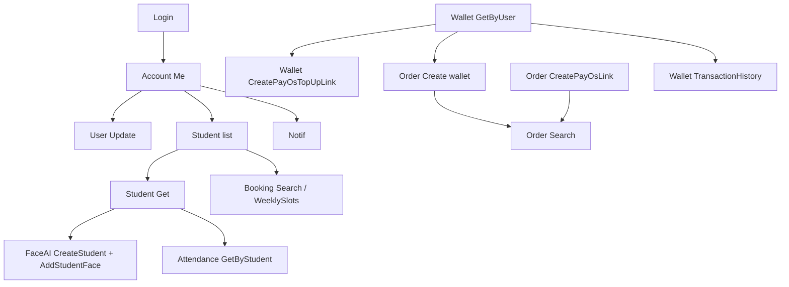

# Luồng 2 — Phụ huynh (guardian): hồ sơ → học sinh → booking → ví / PayOS → gói → lịch sử → điểm danh → Face AI

Tài liệu cho **app phụ huynh** gọi BE. Base URL: `BASE_URL` (vd `https://localhost:5001`). Chi tiết body bổ sung: [`API_TEST_JSON.md`](./API_TEST_JSON.md).

---

## 1. Quy ước chung

| Mục | Giá trị |
|-----|---------|
| **JWT** | Đăng nhập role **guardian**. Gửi `Authorization: Bearer <token>` cho mọi API có `[Authorize]` hoặc khi đọc `UserId` / `Role` từ token. |
| **Envelope** | `{ "message": string, "data": object \| null }`. **Thành công:** HTTP **200**. **Lỗi nghiệp vụ:** HTTP **400**, `data` thường `null`, UI đọc `message`. |
| **Không có field `success`** | FE dùng `response.ok` / `status === 200`. |

### 1.1 JSON thành công / thất bại (mẫu)

**Thành công:**

```json
{
  "message": "Lấy danh sách student thành công",
  "data": { "totalItems": 1, "page": 1, "pageSize": 10, "items": [] }
}
```

**Thất bại (400):**

```json
{
  "message": "So du khong du de mua goi",
  "data": null
}
```

**401** — thiếu / sai token (endpoint có `[Authorize]`).

---

### 1.2 Status / enum UI cần biết (luồng phụ huynh)

| Miền | Field | Giá trị |
|------|--------|---------|
| **Order** | `status` / `orderStatus` | `PENDING`, `PAID`, `CANCELLED`, `EXPIRED` |
| **Order PayOS** (`OrderPayOsStatusDto`) | `orderStatus`, `transactionStatus` | Chuỗi theo BE sau thanh toán / webhook |
| **Booking** | `status` | `PENDING`, `CONFIRMED`, `CANCELLED` |
| **Attendance** | `status` | `CHECKED_IN`, `CHECKED_OUT` |
| **Giao dịch ví** (`Wallet/TransactionHistory`) | `status` | `PENDING`, `PAID`, `CANCELLED`, `FAILED`, … |
| **TransactionLog** (global search—ít dùng cho PH) | `method` | `WALLET`, `PAYOS_ORDER`, … ; `status`: `SUCCESS`, `FAILED`, … |
| **Slot tuần** (`WeeklySlots`) | `slots[].kind` | `hard`, `soft` |

---

### 1.3 Thông báo trong app

Hệ thống **ghi** thông báo vào bảng `Notifications` + **push FCM**. Đọc lịch sử trong app:

| API | `GET /api/Notification/Search` — **[Authorize]** Bearer |
|-----|-------------------------------------------------------------|

**Query (tất cả optional trừ khi cần lọc):**

| Param | Ý nghĩa |
|-------|---------|
| *(không gửi `userId`)* | Chỉ lấy thông báo của **user trong JWT** (phụ huynh dùng cách này). |
| `userId` | **Admin:** xem thông báo user đó. **User khác:** chỉ được nếu `userId` **trùng** token; nếu khác → 400 *"Không được xem thông báo của user khác"*. |
| `isRead` | `true` / `false` — chỉ tin đã đọc / chưa đọc. |
| `type` | Lọc đúng chuỗi `Type` (vd loại push attendance). |
| `fromDate`, `toDate` | Theo ngày `CreatedAt` (inclusive theo ngày). |
| `page`, `pageSize` | Phân trang (mặc định `page=1`, `pageSize=20`, tối đa 100). |

**Response 200:** `data` = `PagedResult` với `items[]`: `id`, `userId`, `message`, `type`, `isRead`, `createdAt`.

**Response 400:** envelope chuẩn; 401 nếu thiếu token.

Chi tiết query mẫu: [`API_TEST_JSON.md`](./API_TEST_JSON.md) mục **NotificationController**.

---

## 2. Thứ tự nghiệp vụ đề xuất

1. **Login** → lưu token.  
2. **Me** → `userId` phụ huynh.  
3. **Cập nhật hồ sơ**: đổi **ảnh đại diện** → gọi **`POST /api/Upload/Image`** (`multipart/form-data`, field `file`) → lấy **`data.url`** → **`PUT /api/User/Update/{userId}`** với `avatarUrl` = URL đó (cùng các field `fullName`, `phone`, …).  
4. **Danh sách học sinh** (`Student/GetMyStudents` hoặc `GetByGuardian`).  
5. **Chi tiết học sinh** + **Face AI**: tạo học sinh trên FaceAI (`FaceAI/CreateStudent`) → **upload ảnh đăng ký khuôn mặt** (`FaceAI/AddStudentFace`) → xem ảnh/face (`GetStudentImages` / `GetStudentFaces`); tuỳ chọn thử nhận diện (`VerifyStudent`).  
6. **Sửa học sinh** (`Student/Update`) — chỉ cho học sinh của mình (FE kiểm tra `guardianId`; BE hiện không khóa theo token).  
7. **Khung giờ booking** (`Booking/WeeklySlots`) → tạo/sửa **Booking** nếu có màn đặt lịch.  
8. **Xem booking** (`Booking/Search` theo `studentId`).  
9. **Ví** (`Wallet/GetByUser/{guardianId}`) → **nạp PayOS** hoặc **TopUp** nội bộ (nếu bật).  
10. **Mua gói ví** (`Order/Create`) hoặc **mua PayOS** (`Order/CreatePayOsLink` → thanh toán → `GetPayOsStatus`).  
11. **Lịch sử mua** (`Order/Search` / `GetByGuardian`).  
12. **Lịch sử giao dịch ví** (`Wallet/TransactionHistory/{walletId}`).  
13. **Chi tiết gói** (`Package/Get/{id}`).  
14. **Điểm danh lên/xuống** (`Attendance/GetByStudent` hoặc `Attendance/Search` với `guardianId`).  
15. **Thông báo đã lưu** (`Notification/Search` không gửi `userId` — theo JWT).



---

## 3. Bước chi tiết + JSON mẫu

### Bước 1 — Đăng nhập phụ huynh

| API | `POST /api/Account/Login` |
|-----|---------------------------|

**Request:**

```json
{
  "email": "phuhuynh@example.com",
  "password": "123456",
  "deviceToken": "fcm_optional"
}
```

**Response 200:**

```json
{
  "message": "Đăng nhập thành công.",
  "data": { "token": "eyJhbGciOiJIUzI1NiIs..." }
}
```

**Response 400** (sai mật khẩu / không có tài khoản / vô hiệu): `{ "message": "...", "data": null }` — xem [`FLOW_01_ADMIN_APP_E2E.md`](./FLOW_01_ADMIN_APP_E2E.md) mục 1.1.

---

### Bước 2 — Xem / sửa hồ sơ chính mình

| Mục | API |
|-----|-----|
| Xem | `GET /api/Account/Me` — **[Authorize]** |
| **Upload ảnh (avatar / minh họa)** | `POST /api/Upload/Image` — `multipart/form-data`, field **`file`** (ảnh, `Content-Type` dạng `image/*`) |
| Sửa | `PUT /api/User/Update/{id}` với **`id` = `UserId` trong token** |

**Luồng đổi avatar:** `Upload/Image` (200) → copy `data.url` → `User/Update` body `avatarUrl`. Không có API “upload kèm trong một request Update”; avatar luôn là URL string sau khi upload Cloudinary.

#### `POST /api/Upload/Image`

- **Headers:** `Content-Type: multipart/form-data`.  
- **Form:** một part tên **`file`** (giống [`API_TEST_JSON.md`](./API_TEST_JSON.md) mục Upload).

**Response 200:**

```json
{
  "message": "Upload ảnh thành công",
  "data": {
    "url": "https://res.cloudinary.com/.../image/upload/v1/xxx.jpg",
    "publicId": "folder/xxx",
    "format": "jpg",
    "bytes": 45231
  }
}
```

**Response 400 — ví dụ:** `{ "message": "File ảnh không được để trống", "data": null }`, `{ "message": "File tải lên phải là ảnh", "data": null }`, hoặc lỗi cấu hình / Cloudinary (`"Chưa cấu hình Cloudinary"`, …).

> `UploadController` hiện **không** bắt `[Authorize]`; app phụ huynh nên chỉ gọi sau khi đăng nhập và (nếu cần) BE bổ sung policy sau.

**GET Me — Response 200 (`AccountDto` — ví dụ):**

```json
{
  "message": "Lấy thông tin tài khoản thành công.",
  "data": {
    "id": 42,
    "email": "phuhuynh@example.com",
    "fullName": "Nguyễn Văn A",
    "phone": "0909123456",
    "avatarUrl": "https://cdn.example/avatar.jpg",
    "role": "guardian",
    "status": "ACTIVE",
    "deviceToken": "optional_fcm"
  }
}
```

**PUT User/Update — Request (một phần field):**

```json
{
  "fullName": "Nguyễn Văn A",
  "phone": "0909123456",
  "avatarUrl": "https://res.cloudinary.com/.../image/upload/v1/xxx.jpg",
  "password": null
}
```

(`avatarUrl` lấy từ `data.url` của bước **`POST /api/Upload/Image`**.)

**Response 400** (email trùng, SĐT trùng, …): `{ "message": "Email da ton tai.", "data": null }`

---

### Bước 3 — Danh sách học sinh của tôi

| Ưu tiên | API |
|---------|-----|
| **Khuyên dùng** | `GET /api/Student/GetMyStudents` — **[Authorize]** — chỉ role `guardian`. |
| Khác | `GET /api/Student/GetByGuardian/{guardianId}` với `guardianId` = id phụ huynh (cần biết id). |

**GetMyStudents — Response 200:**

```json
{
  "message": "Lấy danh sách student thành công",
  "data": [
    {
      "id": 1,
      "studentCode": "ST001",
      "fullName": "Trần B",
      "guardianId": 42,
      "guardianName": "Nguyễn Văn A",
      "campusId": 1,
      "campusName": "Campus Quận 1",
      "status": "ACTIVE"
    }
  ]
}
```

**Response 400** (không phải guardian): `{ "message": "Tài khoản hiện tại không phải guardian", "data": null }`

---

### Bước 4 — Chi tiết học sinh + chỉnh sửa (chỉ con mình)

| Mục | API |
|-----|-----|
| Chi tiết | `GET /api/Student/Get/{id}` |
| Cập nhật | `PUT /api/Student/Update/{id}` |

**Update — Request (ví dụ đổi tên/ảnh; không đổi `guardianId` nếu không cần):**

```json
{
  "fullName": "Trần Bình",
  "avatarUrl": "https://cdn.example/student.jpg",
  "dateOfBirth": "2015-03-10T00:00:00",
  "gender": "Male",
  "studentCode": null,
  "guardianId": null,
  "campusId": null,
  "status": null
}
```

**Response 200:** `data` là `StudentDto`.

**Response 400:** `"Student không tồn tại"`, trùng hồ sơ, `Status` không hợp lệ (`ACTIVE`/`DISABLED`).

> **Lưu ý bảo mật:** BE hiện **không** kiểm tra token phụ huynh khi `Student/Update`. FE **chỉ** gọi update cho `studentId` lấy từ `GetMyStudents` / `GetByGuardian` của chính phụ huynh.

---

### Bước 5 — Face AI: đăng ký khuôn mặt học sinh & xem đã upload

Luồng đề xuất trên app phụ huynh (chỉ gọi với `studentId` thuộc `GetMyStudents`):

1. Đảm bảo học sinh đã có trong DB và có **`fullName`** (BE dùng tên khi gọi FaceAI lúc thêm face).  
2. **`CreateStudent`** — tạo bản ghi học sinh trên **dịch vụ FaceAI** (map theo `studentId`).  
3. **`AddStudentFace`** — upload **một ảnh** / lần; có thể gọi **nhiều lần** để đăng ký nhiều góc.  
4. **`GetStudentImages` / `GetStudentFaces`** — hiển thị ảnh & metadata face đã có (màn “đã đăng ký”).  
5. *(Tuỳ chọn)* **`VerifyStudent`** — gửi ảnh thử để kiểm tra khớp với học sinh đó trước khi bấm hoàn tất.

> **Lưu ý:** `FaceAIController` hiện **không** gắn `[Authorize]`. FE vẫn nên chỉ expose luồng này cho phụ huynh đã đăng nhập và **chỉ** với `studentId` của con mình; nếu cần chặn server-side, bổ sung policy sau.

#### Bảng API (prefix `BASE_URL/api/FaceAI`)

| Bước | Method | Đường dẫn | Content-Type | Mô tả |
|------|--------|-----------|--------------|--------|
| Health | GET | `/Health` | — | Kiểm tra FaceAI service (debug). |
| Tạo student FaceAI | POST | `/CreateStudent` | `application/json` | Đăng ký học sinh trên FaceAI theo `studentId`. |
| **Upload khuôn mặt** | POST | `/AddStudentFace/{studentId}` | **`multipart/form-data`** | **Đăng ký ảnh khuôn mặt** (file ảnh). |
| Ảnh đã lưu | GET | `/GetStudentImages/{studentId}` | — | Danh sách ảnh (payload do FaceAI trả). |
| Face đã đăng ký | GET | `/GetStudentFaces/{studentId}` | — | Metadata từng face (id face để xóa lẻ nếu cần). |
| Thử nhận diện | POST | `/VerifyStudent/{studentId}` | `multipart/form-data` | So khớp ảnh với học sinh cố định. |
| Xóa một face | DELETE | `/DeleteFace/{faceId}` | — | `faceId` lấy từ `GetStudentFaces`. |
| Xóa hết FaceAI | DELETE | `/DeleteStudent/{studentId}` | — | Xóa toàn bộ dữ liệu FaceAI của học sinh (dùng cẩn thận). |

Chi tiết form/body bổ sung: [`API_TEST_JSON.md`](./API_TEST_JSON.md) mục **FaceAIController**.

---

#### 5.1 — `POST /api/FaceAI/CreateStudent` (JSON)

**Request:**

```json
{
  "studentId": 1,
  "name": "Trần Bình"
}
```

- `name` nên trùng hoặc gần `Student.FullName` trong DB (hiển thị trên FaceAI).  
- Nếu FaceAI đã có `studentId` này, có thể trả lỗi từ dịch vụ — BE bọc trong `message` (HTTP **400**).

**Response 200:**

```json
{
  "message": "Tạo student trên FaceAI thành công",
  "data": {}
}
```

`data` là object JSON do FaceAI trả (có thể rỗng hoặc có id nội bộ — tùy phiên bản service).

---

#### 5.2 — `POST /api/FaceAI/AddStudentFace/{studentId}` — **upload đăng ký khuôn mặt**

- **Headers:** `Content-Type: multipart/form-data` (client để boundary tự sinh).  
- **Form field:** tên **`file`** (một file ảnh).  
- **Ràng buộc BE:** file không rỗng; `Content-Type` phải bắt đầu bằng `image/` (vd `image/jpeg`, `image/png`).  
- BE đọc `FullName` học sinh trong DB để gửi kèm sang FaceAI (`name` query).

**Ví dụ gọi (Postman / FE):** path `studentId` = `1`, body form-data key `file` = chọn ảnh.

**Response 200:**

```json
{
  "message": "Đăng ký khuôn mặt học sinh thành công",
  "data": {}
}
```

`data` là object FaceAI (vd embedding / face id — tùy API FaceAI).

**Response 400 — ví dụ:**

```json
{
  "message": "File ảnh không được để trống",
  "data": null
}
```

```json
{
  "message": "Không tìm thấy học sinh trong hệ thống",
  "data": null
}
```

```json
{
  "message": "Học sinh chưa có tên để đồng bộ sang FaceAI",
  "data": null
}
```

```json
{
  "message": "File tải lên phải là ảnh",
  "data": null
}
```

Lỗi từ HTTP FaceAI (timeout, 4xx/5xx) cũng được map qua `message` (400).

---

#### 5.3 — Xem ảnh & face đã đăng ký

| API | `GET /api/FaceAI/GetStudentImages/{studentId}` |
| API | `GET /api/FaceAI/GetStudentFaces/{studentId}` |

**Response 200:** `data` là **object** thô từ FaceAI (cấu trúc không cố định trong BE). UI có thể parse `faces[].id` (hoặc tương đương) để hiển thị nút xóa và gọi `DELETE /api/FaceAI/DeleteFace/{faceId}`.

Ví dụ khung (minh họa):

```json
{
  "message": "Lấy ảnh của student thành công",
  "data": {
    "studentId": 1,
    "images": []
  }
}
```

---

#### 5.4 — (Tuỳ chọn) `POST /api/FaceAI/VerifyStudent/{studentId}`

Cùng kiểu **multipart**, field **`file`** — kiểm tra ảnh chụp có khớp học sinh không (ngưỡng similarity lấy từ cấu hình hệ thống).

**Response 200:** `data` object kết quả verify từ FaceAI.  
**Response 400:** ảnh không hợp lệ hoặc không khớp (message từ BE/FaceAI).

---

### Bước 6 — Khung giờ đặt xe & booking

| Mục | API |
|-----|-----|
| Slot 8 ngày | `GET /api/Booking/WeeklySlots` — không query |
| Danh sách booking | `GET /api/Booking/Search?studentId=1&routeId=&serviceDate=&status=&page=1&pageSize=20` |
| Chi tiết | `GET /api/Booking/Get/{id}` |
| Tạo / sửa / xóa | `POST /api/Booking/Create`, `PUT /api/Booking/Update/{id}`, `DELETE /api/Booking/Delete/{id}` |

**Search booking — Response 200** (`PagedResult<BookingDto>`):

```json
{
  "message": "Lay danh sach booking thanh cong",
  "data": {
    "totalItems": 2,
    "page": 1,
    "pageSize": 20,
    "items": [
      {
        "id": 100,
        "studentId": 1,
        "studentCode": "ST001",
        "studentName": "Trần B",
        "routeId": 10,
        "routeName": "Tuyến A",
        "serviceDate": "2026-05-10T00:00:00",
        "startTime": "07:00:00",
        "stationId": 2,
        "stationName": "Trạm Công viên",
        "status": "CONFIRMED",
        "latitude": 10.775,
        "longitude": 106.7,
        "note": null,
        "createdAt": "2026-04-28T10:00:00Z"
      }
    ]
  }
}
```

---

### Bước 7 — Ví: xem số dư

| API | `GET /api/Wallet/GetByUser/{userId}` — `userId` = **guardian id** |

**Response 200:**

```json
{
  "message": "Lấy ví thành công",
  "data": {
    "id": 5,
    "userId": 42,
    "userName": "Nguyễn Văn A",
    "email": "phuhuynh@example.com",
    "balance": 1500000
  }
}
```

---

### Bước 8 — Nạp tiền ví bằng PayOS

| Mục | API |
|-----|-----|
| Tạo link | `POST /api/Wallet/CreatePayOsTopUpLink` |
| Tra cứu | `GET /api/Wallet/GetPayOsTopUpStatus/{orderCode}` |

**CreatePayOsTopUpLink — Request:**

```json
{
  "userId": 42,
  "amount": 500000,
  "returnUrl": "https://app.example/wallet/success",
  "cancelUrl": "https://app.example/wallet/cancel"
}
```

**Response 200 (ví dụ):** `data` chứa link thanh toán + `orderCode` (theo `WalletService` / Dto PayOS).

**Response 400:** cấu hình PayOS, số tiền không hợp lệ, user không phải guardian, …

---

### Bước 9 — Mua gói **bằng ví** (trừ tiền ngay)

| API | `POST /api/Order/Create` |

**`routeIds` lấy ở đâu để đúng campus của học sinh?**

1. Lấy `studentId` đã chọn -> gọi `GET /api/Student/Get/{studentId}` để đọc `campusId`.  
2. Gọi `GET /api/BusRoute/Active?campusId=<campusId>&keyword=&page=1&pageSize=50` (hoặc `BusRoute/Search`) để lấy danh sách tuyến hợp lệ.  
3. Cho phụ huynh chọn tuyến từ list trên, lấy `id` của tuyến đưa vào `routeIds`.

**Ví dụ response lấy `campusId` từ Student/Get:**

```json
{
  "message": "Lấy student thành công",
  "data": {
    "id": 1,
    "fullName": "Trần Bình",
    "campusId": 1,
    "campusName": "Campus Quận 1"
  }
}
```

**Ví dụ response lấy route theo campus:**

```json
{
  "message": "Lấy danh sách bus route thành công",
  "data": {
    "totalItems": 2,
    "page": 1,
    "pageSize": 50,
    "items": [
      { "id": 10, "name": "Tuyến A - Sáng", "campusId": 1, "isEnabled": true },
      { "id": 12, "name": "Tuyến B - Chiều", "campusId": 1, "isEnabled": true }
    ]
  }
}
```

=> Khi đó gửi `routeIds: [10]` hoặc nhiều id hợp lệ theo giới hạn gói.

**Request:**

```json
{
  "guardianId": 42,
  "studentId": 1,
  "packageId": 1,
  "routeIds": [10]
}
```

**Response 200:** `data` là `OrderDto` (`status`: **`PAID`** ngay).

**Response 400 — ví dụ:**

```json
{
  "message": "So du khong du de mua goi",
  "data": null
}
```

```json
{
  "message": "Guardian chua co vi. Vui long nap tien truoc",
  "data": null
}
```

---

### Bước 10 — Mua gói **bằng PayOS** (link thanh toán)

| Mục | API |
|-----|-----|
| Tạo link | `POST /api/Order/CreatePayOsLink` |
| Trạng thái | `GET /api/Order/GetPayOsStatus/{orderCode}` |

**CreatePayOsLink — Request:**

```json
{
  "guardianId": 42,
  "studentId": 1,
  "packageId": 1,
  "routeIds": [10],
  "returnUrl": "https://app.example/order/success",
  "cancelUrl": "https://app.example/order/cancel"
}
```

**Response 200 (`OrderPayOsLinkDto`):**

```json
{
  "message": "Tao link thanh toan payOS cho order thanh cong",
  "data": {
    "orderId": 99,
    "guardianId": 42,
    "studentId": 1,
    "packageId": 1,
    "packageName": "Gói 3 tháng",
    "selectedRouteIds": [10],
    "packageRouteLimit": 2,
    "orderCode": 123456789,
    "amount": 1200000,
    "description": "Thanh toan goi",
    "checkoutUrl": "https://pay.payos.vn/web/...",
    "status": "PENDING",
    "createdAt": "2026-04-29T08:00:00Z"
  }
}
```

**GetPayOsStatus — Response 200 (`OrderPayOsStatusDto`):**

```json
{
  "message": "Lay order thanh cong",
  "data": {
    "orderId": 99,
    "orderCode": 123456789,
    "amount": 1200000,
    "orderStatus": "PAID",
    "transactionStatus": "SUCCESS",
    "paidAt": "2026-04-29T08:05:00Z",
    "startDate": "2026-04-29T08:05:00Z",
    "endDate": "2026-07-28T08:05:00Z",
    "createdAt": "2026-04-29T08:00:00Z"
  }
}
```

*(Giá trị `orderStatus` / `transactionStatus` theo BE sau webhook.)*

---

### Bước 11 — Lịch sử **mua gói** (order)

| API | Ghi chú |
|-----|---------|
| `GET /api/Order/Search?guardianId=42&studentId=&status=&fromDate=&toDate=&page=1&pageSize=10` | Lọc `status`: `PENDING`, `PAID`, `CANCELLED`, `EXPIRED` |
| `GET /api/Order/GetByGuardian/{guardianId}` | Danh sách không phân trang (theo service) |
| `GET /api/Order/Get/{id}` | Chi tiết một đơn |

**Search — Response 200:** `data` = `PagedResult<OrderDto>`.

---

### Bước 12 — Lịch sử **giao dịch ví**

| API | `GET /api/Wallet/TransactionHistory/{walletId}?fromDate=&toDate=&method=&status=&page=1&pageSize=20` |

**Phụ thuộc:** `walletId` từ `Wallet/GetByUser/{guardianId}`.

**Response 200 (minh họa một dòng):**

```json
{
  "message": "Lấy lịch sử giao dịch ví thành công",
  "data": {
    "totalItems": 5,
    "page": 1,
    "pageSize": 20,
    "items": [
      {
        "id": 1001,
        "amount": 1200000,
        "method": "WALLET",
        "status": "SUCCESS",
        "paidAt": "2026-04-29T08:05:00Z",
        "description": "Thanh toan goi Gói 3 tháng bang vi",
        "code": "WALLET-ABC..."
      }
    ]
  }
}
```

*(Cấu trúc item đúng theo Dto BE — có thể có `oldBalance`/`newBalance`.)*

---

### Bước 13 — Chi tiết **gói** (trước khi mua)

| API |
|-----|
| `GET /api/Package/Get/{id}` |
| `GET /api/Package/Active?keyword=&page=1&pageSize=10` |

**Get — Response 200:** `data` = `PackageDto` (`name`, `price`, `durationDays`, `routeLimit`, `status`, …).

---

### Bước 14 — Lịch sử **lên xe / xuống xe** (điểm danh)

| API | Ghi chú |
|-----|---------|
| `GET /api/Attendance/GetByStudent/{studentId}?fromDate=2026-04-01&toDate=2026-04-30` | Theo từng con |
| `GET /api/Attendance/Search?guardianId=42&studentId=&date=&status=&page=1&pageSize=20` | Một hoặc nhiều con |

**status filter:** `CHECKED_IN`, `CHECKED_OUT`.

**Response 200:** `data` dạng phân trang hoặc list theo service.

---

## 4. Bảng phụ thuộc GET (tóm tắt)

| Cần làm | Lấy từ đâu |
|---------|------------|
| `Student/Update`, FaceAI, Booking, Attendance theo con | `studentId` từ `GetMyStudents` |
| `FaceAI/CreateStudent` (`name`) | Nên khớp `fullName` từ `Student/Get` / danh sách |
| `FaceAI/AddStudentFace` | `studentId` + học sinh trong DB **có** `fullName` (BE bắt buộc) |
| `FaceAI/DeleteFace` | `faceId` từ payload `GetStudentFaces` (FaceAI) |
| `User/Update` (`avatarUrl`) | `data.url` từ `POST /api/Upload/Image` |
| `Wallet/GetByUser`, `Order/Create` | `guardianId` = `Me.id` |
| `Wallet/TransactionHistory` | `walletId` từ `GetByUser` |
| `Order/Create`, `CreatePayOsLink` | `packageId` từ `Package/Get` / `Active`; `routeIds` từ tuyến phù hợp campus |
| `Notification/Search` | Không cần `userId` — BE lấy từ JWT |

---

## 5. Tài liệu liên quan

- [`FLOW_01_ADMIN_APP_E2E.md`](./FLOW_01_ADMIN_APP_E2E.md) — envelope + bảng status mở rộng.
- [`API_TEST_JSON.md`](./API_TEST_JSON.md) — JSON đầy đủ từng endpoint.

---

*Cập nhật theo Controllers hiện có. API **`GET /api/Notification/Search`** dùng cho lịch sử thông báo theo user (JWT).*
